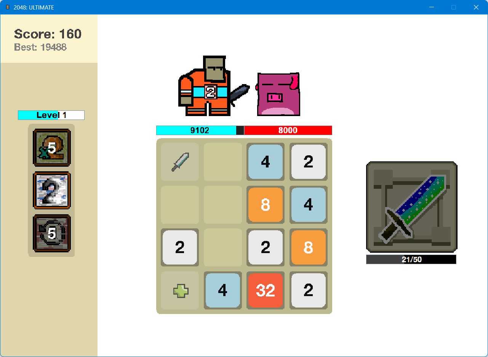
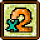
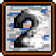
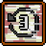

# **2048: ULTIMATE**
## 1. Repository Introduction

_Note: The game is still in early stages of development, and it is not the complete representation of the final product._

This documentation provides all essential information about this repository: a remake of the original 2048 game created for the university's Data Structures & Algorithms course. 
Some parts of the code refer to the **2048 Tutorial Series** by Scott Bass (old name: FatalCubez), which can be found [here](https://youtube.com/playlist?list=PLig6-gM-fHMGH6jmCpsxW6YbagHgCS3Jd&si=DOV_Fjm_q7aKs9-4).

---

## 2. Installation & Setup
We compiled the file as a single Java Archive file, namely **2048.jar**.
You can [download the ZIP file](https://github.com/quocthang-98/2048-Ultimate/archive/refs/heads/master.zip) of this repo, then run **2048.jar** file to start playing.

You can also **clone** this repo, following these steps (for Windows):

1. **Create** an empty folder, give it a name, then open it.
2. Right-click anywhere in the folder, and choose **"Open in Terminal"**.
3. Paste this command in the terminal, then hit **Enter** to execute:
   > git clone https://github.com/quocthang-98/2048-Ultimate.git
4. After the cloning step is done, you can open **2048.jar** in the folder to start playing (or explore our code, if you want to).

Make sure you have **Git** set up on your computer. Read, or watch following tutorials for more:

[Getting started with Git](https://docs.github.com/en/get-started/getting-started-with-git) - documentation from GitHub.

[How to Download & Install Git on Windows 11 - Git Installation](https://www.youtube.com/watch?v=JgOs70Y7jew) - Youtube video by Discover You (2022)

---

## 3. How to Play
### 3.1. Basic Controls

_Currently, there is no "Key Binding" options. Stay tuned for future updates._

[W]- Move up

[S] - Move down

[A] - Move left

[D] - Move right

[SPACE] - Attack/Heal

[1] - Ability 1

[2] - Ability 2

[3] - Ability 3

### 3.2. Gameplay

- The objective is to attack the baddie until his health drops to 0 - The damage is based on the sum of the current values from the "attacking cells".
- As player swings an attack, he can also heal an amount of the sum of the current values from the "healing cells".
- Abilities help player with better advantages.
- If the player's health point reaches 0, OR if there is no more possible moves, the game is over.

### 3.3. Abilities

- [1] DOUBLE: Every cell's value is doubled.
- [2] WIPE: Remove all of the 2's cells.
- [3] REVERSE: Go back 3 moves.

_Stay tuned for more ability updates!_

---

## 4. Development Process

...

---

## 5. Licenses
This repository does not have an open-source license.  
Without explicit permission, you **cannot** copy, modify, or distribute this project.  
If you’re interested in using it, please contact me at **phanquocthangabc@gmail.com**

---

## 6. Credits

**Original game by Gabriele Cirulli**
 

**Project Manager**

Duong Minh Tuan

**Game Designers**

Phan Quoc Thang

Duong Minh Tuan

**Programmers**

Phan Quoc Thang

Duong Minh Tuan

TrunggTruong

**User Interface Developers**

Duong Minh Tuan

TrunggTruong

**Arts**

Phan Quoc Thang

**Animations**

Phan Quoc Thang

 

_Special thanks to Mr. Tung & Mr. Nghia for their unwavering support and guidance throughout our DSA course._

